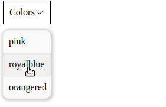

# Dropdown Menu &middot;    

<div align="center">
<p>A small JS library for creating dropdown menus.</p>



<div>
    <a href="https://npm.runkit.com/%40lindelwa122%2Fdropdown-menu">Try on RunKit</a>
    &middot;
    <a href="https://github.com/lindelwa122/dropdown-menu/issues">Report Bugs</a>
    &middot;
    <a href="https://github.com/lindelwa122/dropdown-menu/issues">Request Feature</a>
</div>

</div>

## About The Project

Dropdown Menu is a library that allows you to create customizable dropdowns on the go. It's easy to use and provides click handling functionalities. 

## Usage

Import the `dropdown-menu` like this:

```javascript
import dropdown from "@lindelwa122/dropdown-menu";
```

You can create multiple instances of `dropdown` for various purposes. Below, I demonstrate creating a dropdown to display multiple colors.

```javascript
const colorList = ["pink", "royalblue", "orangered"];

const clickHandler = (e) => {
    const color = e.target.innerText;
    document.body.style.backgroundColor = color;
}

const colors = dropdown("Colors", colorList, clickHandler);
```

`dropdown` takes three parameters: `title`, `listItems`, and `clickHandler`. `title` is what gets displayed in the HTML, `listItems` is an array that is displayed when you click on the dropdown, and `clickHandler` is an optional function that gets invoked when one of the `listItems` is clicked.

In the above code, we create a dropdown with three list items: `["pink", "royalblue", "orangered"]`. When one of these is clicked, the background color changes accordingly.

In future versions, `dropdown` will have an additional parameter `options` that will add extra properties to each item.

Here's the final step to add the dropdown to the page:

```javascript
colors.append("#root");
```

`#root` is a selector that exists in my HTML. In the future, this library will be directly used in [@dom-manipulation-library](https://github.com/lindelwa122/dom-manipulation-library) and will have full support for React.

You can create as many instances of `dropdown` as you need.
## Installation

Install using NPM:

```
npm install @lindelwa122/dropdown-menu
```

## Example

```javascript
import dropdown from "@lindelwa122/dropdown-menu";

const colorList = ["pink", "royalblue", "orangered"];

const clickHandler = (e) => {
    const color = e.target.innerText;
    document.body.style.backgroundColor = color;
}

const colors = dropdown("Colors", colorList, clickHandler);
colors.append("#root");
```

## Contributing

Contributions are welcome, if you have any ideas of how can we make this project better please create an [issue](https://github.com/lindelwa122/dropdown-menu/issues)

## Contact

* GitHub: https://github.com/lindelwa122
* Email: nqabenhlemlaba22@gmail.com
* Instagram: [https://instagram.com/q.codes__](https://instagram.com/q.codes__)

## Acknowledgements

* Project inspired by [The Odin Project's](https://theodinproject.com) exercise.
